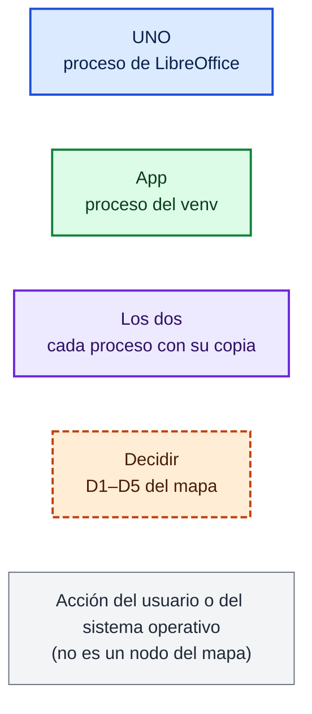
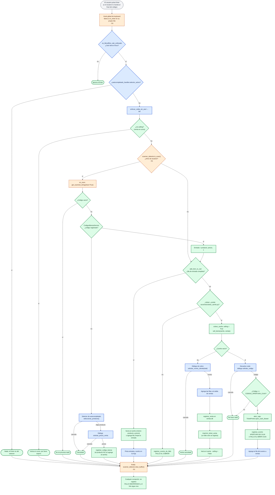
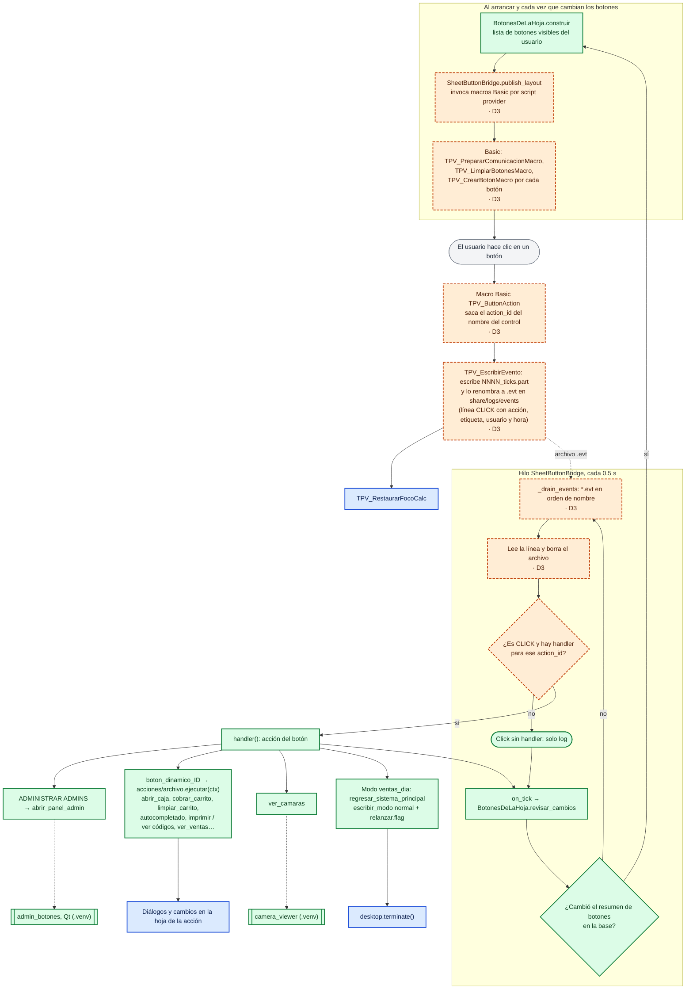
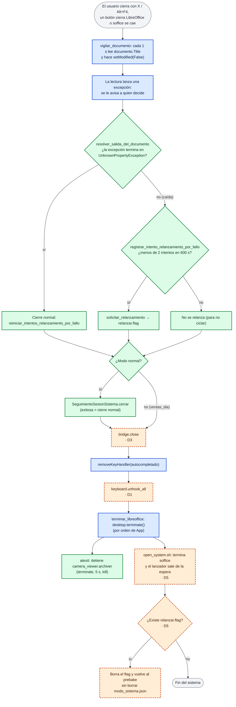

# Diagrama de flujo del sistema de ventas V2

Complemento visual de `mapa_v2.md`. Se levantó leyendo el mapa y el código de `v_2`
(`open_system.sh`, `libreofficeModules/Module1`, `main.py`, `nucleo/`, `services/`). Cada nodo
lleva el color de la propuesta del mapa para la V3.

## Leyenda

- Las flechas punteadas (`-.->`) son procesos que se lanzan aparte, en el venv, y no se esperan.
- Cuando un nodo es de la propuesta **Decidir**, el texto dice cuál decisión (D1–D5).
- Donde el mapa reparte un paso entre los dos procesos (App decide, UNO pinta), se dibujan dos
  nodos: uno para la decisión y otro para lo que se pinta en la hoja.

## 1. Arranque

```mermaid
flowchart TD
    A0(["Doble clic en el ícono / reinicio de la máquina"]):::externo
    A1["open_system.sh / .bat<br/>bucle del lanzador"]:::decidir
    A2{"¿Primera vuelta del bucle?"}:::decidir
    A3["Borra share/logs/modo_sistema.json<br/>(siempre arranca en modo normal)"]:::app
    A4["prebake_ventas.py en .venv<br/>hornea share/main.ods con odfpy<br/>· D4"]:::decidir
    A5["Borra el lock de main.ods<br/>solo si no hay soffice.bin del usuario"]:::decidir
    A6["libreoffice --accept puerto 2002 main.ods<br/>el lanzador espera a que termine<br/>· D5"]:::decidir
    A7["Macro Basic Module1.Main<br/>TPV_PrepararComunicacion + TPV_LimpiarBotones<br/>· D5"]:::decidir
    A8["Shell sin esperar:<br/>Linux: sudo /usr/bin/python3 main.py<br/>Windows: python.exe de LibreOffice main.py<br/>· D5"]:::decidir

    A0 --> A1 --> A2
    A2 -- "sí" --> A3 --> A4
    A2 -- "no (relanzamiento)" --> A4
    A4 --> A5 --> A6 --> A7 --> A8

    B1["main.py: activar_log_de_depuracion<br/>+ activar_volcado_de_hilos (SIGUSR1)"]:::dos
    B2{"¿Se puede importar uno?"}:::uno
    B2x(["sys.exit(1)"]):::uno
    B3["rich.traceback.install<br/>(se reemplaza por tracebacks de stdlib en los dos)"]:::dos
    B4["nucleo.arranque.ejecutar()"]:::app
    B5{"asegurar_instancia_unica<br/>¿el puerto 2002 es de este usuario?"}:::app
    B5x(["Cierra el sistema del otro usuario,<br/>deja relanzar.flag y sys.exit(0)"]):::app
    B6["_iniciar_archivador_de_camaras"]:::app
    P1[["camera_viewer.archiver<br/>(.venv, segundo plano, todo el tiempo)"]]:::app
    B7["conectar_libreoffice + obtener_documento_calc"]:::uno
    B7x(["No hay documento de Calc: sys.exit(1)"]):::uno
    B8["SheetAdmin (proteger / desproteger la hoja)"]:::uno
    B9["registrar_seguimiento_foco_calc<br/>· D1"]:::uno
    B10{"leer_modo()<br/>modo_sistema.json"}:::app

    A8 --> B1 --> B2
    B2 -- "no" --> B2x
    B2 -- "sí" --> B3 --> B4 --> B5
    B5 -- "no" --> B5x
    B5 -- "sí" --> B6
    B6 -.-> P1
    B6 --> B7
    B7 -- "no" --> B7x
    B7 -- "sí" --> B8 --> B9 --> B10

    %% Modo ventas_dia (solo lectura)
    V1["VentasService.obtener_ventas(fecha)"]:::app
    V2["attach_existing: tabla VENTAS DEL DÍA<br/>que horneó el prebake"]:::uno
    V3["SheetButtonBridge.activate<br/>botón REGRESAR AL SISTEMA PRINCIPAL<br/>· D3"]:::decidir
    V4(["vigilar_documento → ver diagrama 4"]):::uno

    B10 -- "ventas_dia" --> V1 --> V2 --> V3 --> V4

    %% Modo normal
    N1["VentasService, UsuariosService, CatalogoService,<br/>CodigosBarrasService + TableManager"]:::app
    N2["_registrar_usuario<br/>sincroniza con el SO y registra al actual"]:::app
    N2a["Aviso: no se pudo registrar tu usuario"]:::uno
    N3["SeguimientoSesionSistema<br/>(hilo de latido)"]:::app
    N4{"preparar_tablas<br/>¿hoja prehorneada y al día?"}:::uno
    N4a["attach_existing<br/>(se engancha a lo horneado)"]:::uno
    N4b["Reconstruye las tablas en vivo con UNO"]:::uno
    N5["AutocompletadoProductoHandler<br/>addKeyHandler (Tab → selector)"]:::uno
    N6["otorgar_plantilla_a_usuario_nuevo<br/>(solo si el usuario es nuevo)"]:::app
    N7["Contexto + cargar_acciones (acciones/*.py)"]:::app
    N8["ControladorVenta"]:::app
    N9["BotonesDeLaHoja.construir<br/>+ SheetButtonBridge.prepare / publish_layout / start<br/>on_tick = revisar_cambios · D3"]:::decidir
    N10["keyboard.add_hotkey('enter', on_enter)<br/>· D1"]:::decidir
    N11(["vigilar_documento → ver diagrama 4"]):::uno
    P2[["camera_viewer<br/>(botón VER CÁMARAS)"]]:::app
    P3[["admin_botones, Qt<br/>(botón ADMINISTRAR ADMINS, solo ADMIN_RAIZ)"]]:::app

    B10 -- "normal" --> N1 --> N2
    N2 -. "si falla" .-> N2a
    N2 --> N3 --> N4
    N4 -- "sí" --> N4a --> N5
    N4 -- "no" --> N4b --> N5
    N5 --> N6 --> N7 --> N8 --> N9 --> N10 --> N11
    N9 -.-> P2
    N9 -.-> P3

    classDef uno fill:#dbeafe,stroke:#1d4ed8,color:#0b1f4d,stroke-width:2px
    classDef app fill:#dcfce7,stroke:#15803d,color:#0b3d1c,stroke-width:2px
    classDef dos fill:#ede9fe,stroke:#6d28d9,color:#2e1065,stroke-width:2px
    classDef decidir fill:#ffedd5,stroke:#c2410c,color:#4a1d06,stroke-width:2px,stroke-dasharray:6 3
    classDef externo fill:#f3f4f6,stroke:#6b7280,color:#1f2937,stroke-width:1px
```

Notas:

- `open_system.sh`, el lock y el `Main` de Basic no tienen fila propia en la tabla de nodos del
  mapa; se marcan con **D5** (quién lanza a quién) porque esa decisión es la que los define.
  El borrado de `modo_sistema.json` se marca **App** porque el mapa pone `modo_sistema` en el
  lanzador de App.
- `camera_viewer` y `camera_viewer.archiver` son de la otra instancia: aquí solo se dibuja que se
  lanzan.

## 2. Flujo de Enter (`ControladorVenta`)

Notas:

- Los nodos de decisión de `ControladorVenta` son **App** (fila 22 del mapa); lo que hoy se le
  inyecta (foco, celda, diálogos, selector) es **UNO** y en la V3 serían mensajes a UNO.
- La comprobación del foco (E2) sobra si D1 se resuelve con `XKeyHandler` en UNO.
- El Enter con Calc sin foco sale antes del `try`, así que en ese caso no se ejecuta
  `clear_buffer()` (no está dibujado como flecha a F1 a propósito).

## 3. Clic en un botón de la hoja

Notas:

- Todo el camino Basic → `.evt` → sondeo es **UNO** en el mapa, pero el mecanismo es D3; por eso
  va en naranja. Con D3 (b), `XActionListener`, desaparecen U1, U2, H1 y H2.
- En modo `ventas_dia` no hay `on_tick`: solo existe el botón REGRESAR.
- Los botones corren en el hilo de sondeo, no en el de `keyboard`: Enter y un clic pueden correr a
  la vez; lo único que los coordina es `ctx.selling`.

## 4. Cierre

Notas:

- `relanzar.flag` lo escriben tres caminos: el botón REGRESAR y `ver_ventas` (cambio de modo),
  la política de caídas (W6) y `asegurar_instancia_unica` al desplazar a otro usuario.
- En modo `ventas_dia` la salida no pasa por el seguimiento de sesión, el `removeKeyHandler` ni
  `keyboard.unhook_all`: esos no se llegan a crear en ese modo.

## Discrepancias encontradas

Diferencias entre `mapa_v2.md` y el código de `v_2` al 2026-09-29. No se corrigió el mapa.

> **Estado:** revisadas el mismo día. La 2, la 3 y la 4 se verificaron contra el código y ya
> están incorporadas en `mapa_v2.md`. La 1 no es un error: el `Module1` del repo difiere de la
> copia guardada dentro de `main.ods`, que es la que corre y lanza `/usr/bin/python3` (lo
> confirmó el usuario y se ve en el proceso vivo). El diagrama de arranque ya muestra esa ruta.

1. **Intérprete que lanza `Main` en Linux.** El mapa (sección 1) dice
   `sudo /usr/bin/python3 main.py`. En `libreofficeModules/Module1` esa línea está comentada; la
   que corre es `sudo /opt/python_global/bin/python /home/jesjack/sistema_ventas/v_2/main.py`.
2. **`gi` no se usa en el flujo real.** El mapa (tabla de paquetes, nodos 7 y 24, y D1) dice que
   el foco de Calc se comprueba con `gi` como plan B. Pero lo que se inyecta en
   `ControladorVenta` es `calc/calc_window_focus.es_libreoffice_calc_enfocado`, que solo usa UNO
   (`getActiveFrame().getContainerWindow().isActive()`) y devuelve `True` si algo falla. El plan B
   con `gi`/Wnck está en `calc/calc_focus.calc_esta_enfocado`, que nadie llama, y su `import gi`
   es local a la función, así que `main.py` no llega a importar `gi`. Por lo mismo, el estado que
   guarda `registrar_seguimiento_foco_calc` (nodo 7) solo lo lee esa función sin uso: hoy ese
   nodo no alimenta nada.
3. **`Main` de Basic hace más que lanzar Python.** Antes del `Shell` ejecuta
   `TPV_PrepararComunicacion` y `TPV_LimpiarBotones` (prepara la carpeta de eventos y borra los
   botones que hubiera en la hoja). El mapa solo menciona el lanzamiento; importa para D3 y D5.
4. **Pasos del lanzador que el mapa no lista.** En la primera vuelta del bucle, `open_system.sh`
   borra `modo_sistema.json` (por eso un arranque desde el ícono siempre entra en modo normal) y
   el lock de `main.ods` solo se borra si no hay ningún `soffice.bin` del mismo usuario. Tanto
   `open_system.sh` como `Main` usan rutas absolutas fijas (`/home/jesjack/sistema_ventas/v_2`,
   `C:\Users\jesjack\sistema_ventas\v_2`), algo a tener en cuenta con la meta de «misma
   instalación en Windows y Linux».

## Validación de la sintaxis Mermaid

No se validó con una herramienta: en este equipo no hay `node` ni `npx` (y por tanto tampoco
`@mermaid-js/mermaid-cli`), y la regla era no instalar nada global. Se escribió con cuidado para
evitar los tropiezos conocidos (todas las etiquetas entre comillas, sin `|` ni `#` dentro de
las etiquetas, identificadores de nodo sin palabras reservadas), pero conviene abrirlo en un
visor de Mermaid (GitHub, la vista previa de VS Code o mermaid.live) antes de darlo por bueno.
