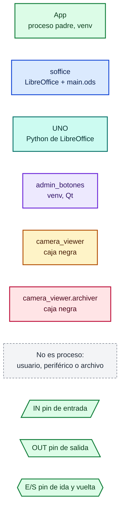
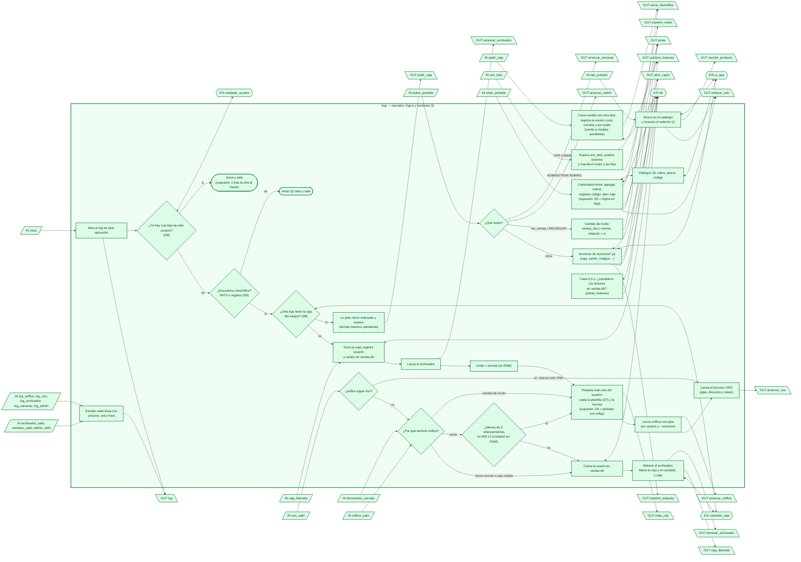
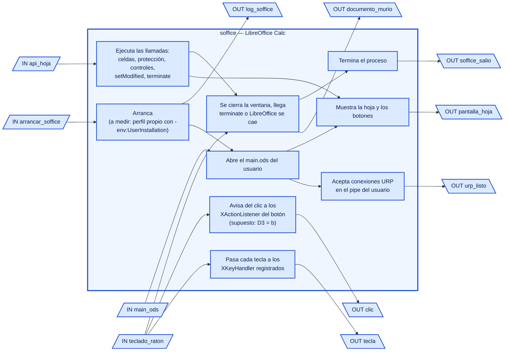
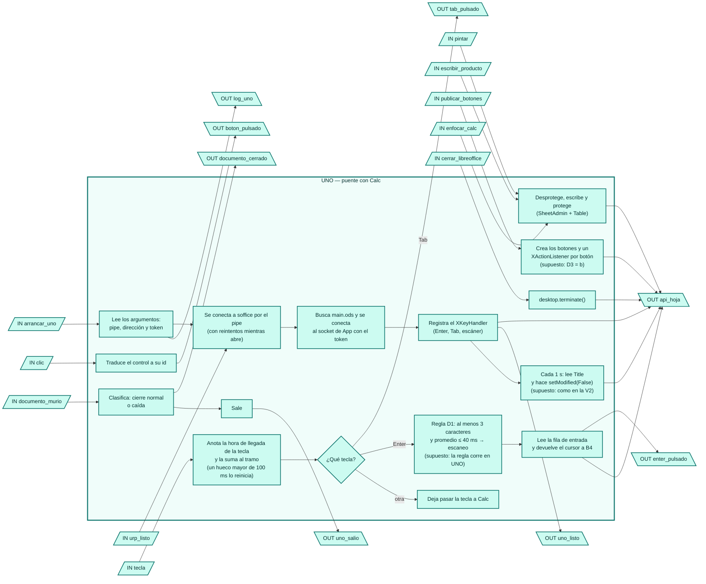
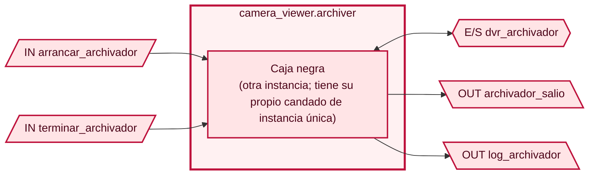
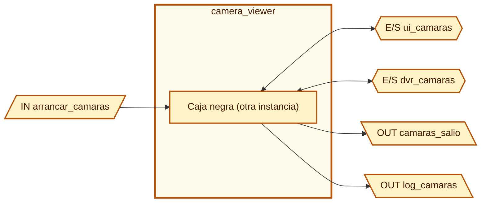
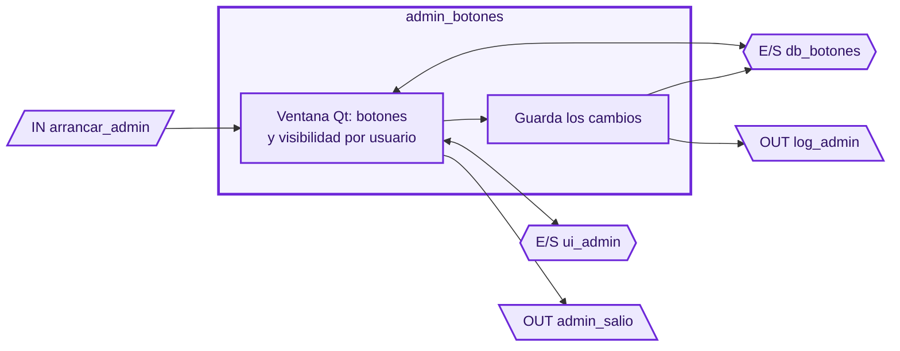
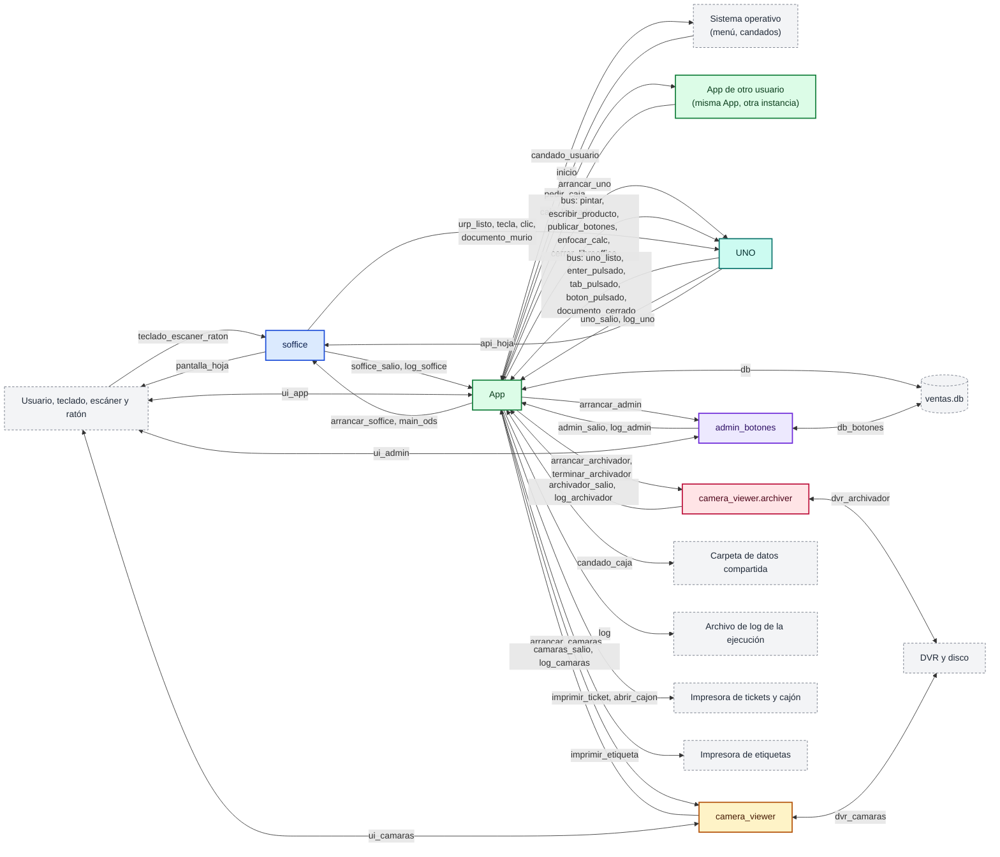

# Diagrama de flujo de la V3, por proceso

Cada proceso de la V3 se dibuja como un **chip** con pines de entrada y salida, al estilo de
microcontroladores en una placa. Sirve para analizar el diseño: qué entra y qué sale de cada
proceso, y con quién conecta. Fuentes: `mapa_v2.md` (D1–D9, al 2026-09-30), `arranque_v3.md`
(opción D5-A, que ya quedó decidida) y `../README.md`.

## Cómo leerlo

- **Un color por proceso.** Cada nodo lleva el color del proceso donde corre. El gris no es un
  proceso: son periféricos, archivos o el usuario. Aparecen solo como extremo de un cable,
  nunca como paso de un flujo.
- **Pines.** Cada pin tiene un nombre único, que se repite igual en los dos extremos del cable,
  como una etiqueta de red en un esquemático. Por ejemplo, OUT `enter_pulsado` en UNO se conecta
  con IN `enter_pulsado` en App.
  - Entrada: paralelogramo inclinado a la derecha, con el texto `IN`.
  - Salida: paralelogramo inclinado a la izquierda, con el texto `OUT`.
  - Entrada y salida (**E/S**): hexágono. Solo para interfaces que por naturaleza van en los
    dos sentidos: la base de datos, un candado del sistema operativo o una ventana que el
    usuario ve y teclea.
- **Supuestos.** Donde el proceso está decidido pero el mecanismo todavía no (D2, D3, D4), el
  nodo dice «(supuesto: …)». Ningún nodo queda sin proceso.
- Debajo de cada chip hay una tabla de pines. Al final están la placa completa y la
  verificación de que cada OUT tiene su IN.

**Hijos de App:** soffice, UNO, camera_viewer.archiver, camera_viewer y admin_botones. App es
el único que lanza procesos (D5-A). Hay una **propuesta** para que admin_botones deje de ser
hijo (ver sección 6).

## 1. App (proceso padre)

Notas:

- **Todos los nodos son App**, incluidas las ventanas Qt: son hilos o ventanas del mismo
  proceso, no hijos.
- **`caja_liberada` solo tiene sentido en la App que cedió la caja.** Si nadie pidió la caja,
  F4 libera `candado_caja` y ahí se acaba. La App que llega se entera por el pin
  `caja_liberada` o por el propio candado.
- **Cambio de modo.** Con D4 = prebake hay que reabrir soffice (F1 → A8). Si D4 termina siendo
  «pintar en vivo», V4 mandaría `pintar` con el modo nuevo y no haría falta cerrar LibreOffice.

| Pin | Dir. | Datos | Conecta con | Mecanismo |
|---|---|---|---|---|
| `inicio` | IN | Argumentos del entry point | Usuario/SO `abrir_icono` | Creación de proceso (menú del sistema, menú Inicio) |
| `candado_usuario` | E/S | Tomar o comprobar el candado | SO | Bloqueo de archivo en la carpeta de ejecución del usuario; se libera solo si el proceso muere |
| `candado_caja` | E/S | Tomar o comprobar la caja del equipo | Carpeta de datos compartida | Bloqueo de archivo en la carpeta compartida (supuesto: el mismo candado sirve para saber si otra App la tiene) |
| `pedir_caja` | OUT | Quién la pide y cuándo | `pedir_caja` IN de la App anterior | Archivo en la carpeta compartida (punto de encuentro de D8) |
| `pedir_caja` | IN | Quién la pide | `pedir_caja` OUT de la App que llega | Ídem |
| `caja_liberada` | OUT | Sesión cerrada, por quién | `caja_liberada` IN de la App que llega | Ídem, o el candado queda libre |
| `caja_liberada` | IN | Ídem | `caja_liberada` OUT de la App anterior | Ídem |
| `db` | E/S | Ventas, usuarios, sesión, catálogo, códigos, botones | `ventas.db` | `sqlite3` |
| `ui_app` | E/S | Diálogos, selector, avisos | Usuario | Ventanas Qt |
| `log` | OUT | Líneas con proceso, pid y hora | Archivo de log de la ejecución | Archivo |
| `main_ods` | OUT | `main.ods` del usuario, horneado | soffice `main_ods` | Archivo en la carpeta del usuario |
| `arrancar_soffice` | OUT | `--accept=pipe,name=…`, `--norestore`, ruta de `main.ods` | soffice `arrancar_soffice` | Creación de proceso (argumentos) |
| `soffice_salio` | IN | Código de salida | soffice `soffice_salio` | Espera del proceso hijo |
| `log_soffice` | IN | stdout/stderr | soffice `log_soffice` | Tubería del proceso hijo |
| `arrancar_uno` | OUT | Nombre del pipe, dirección y token del socket | UNO `arrancar_uno` | Creación de proceso (argumentos) |
| `uno_listo` | IN | Documento encontrado, handlers registrados | UNO `uno_listo` | Socket local |
| `enter_pulsado` | IN | Fila de entrada, texto del tramo, ¿es escaneo? | UNO `enter_pulsado` | Socket local |
| `tab_pulsado` | IN | Prefijo escrito | UNO `tab_pulsado` | Socket local |
| `boton_pulsado` | IN | id del botón | UNO `boton_pulsado` | Socket local |
| `documento_cerrado` | IN | Motivo: cierre normal o caída | UNO `documento_cerrado` | Socket local |
| `uno_salio` | IN | Código de salida | UNO `uno_salio` | Espera del proceso hijo (y el socket se corta) |
| `log_uno` | IN | stdout/stderr, tracebacks | UNO `log_uno` | Tubería del proceso hijo |
| `pintar` | OUT | Modo; filas de entrada, carrito o ventas; fila de evento | UNO `pintar` | Socket local |
| `escribir_producto` | OUT | Producto elegido para B4 | UNO `escribir_producto` | Socket local |
| `publicar_botones` | OUT | Lista (id, etiqueta) | UNO `publicar_botones` | Socket local |
| `enfocar_calc` | OUT | Devolver el foco a Calc y a B4 | UNO `enfocar_calc` | Socket local |
| `cerrar_libreoffice` | OUT | Orden de cierre | UNO `cerrar_libreoffice` | Socket local |
| `arrancar_archivador` | OUT | Módulo a correr, entorno | archivador `arrancar_archivador` | Creación de proceso |
| `terminar_archivador` | OUT | Cierre ordenado (5 s, luego forzado) | archivador `terminar_archivador` | `terminate()` del proceso (SIGTERM en Linux) |
| `archivador_salio` | IN | Código de salida | archivador | Espera del proceso hijo |
| `log_archivador` | IN | stdout/stderr | archivador | Tubería del proceso hijo |
| `arrancar_camaras` | OUT | Módulo a correr, entorno | camera_viewer `arrancar_camaras` | Creación de proceso |
| `camaras_salio` | IN | Código de salida | camera_viewer | Espera del proceso hijo |
| `log_camaras` | IN | stdout/stderr | camera_viewer | Tubería del proceso hijo |
| `arrancar_admin` | OUT | Módulo a correr, entorno | admin_botones `arrancar_admin` | Creación de proceso |
| `admin_salio` | IN | Código de salida | admin_botones | Espera del proceso hijo |
| `log_admin` | IN | stdout/stderr | admin_botones | Tubería del proceso hijo |
| `imprimir_ticket` | OUT | Líneas del ticket, QR | Impresora de tickets | Driver / puerto (como `hardware/ticket_printer.py`) |
| `abrir_cajon` | OUT | Pulso de apertura | Cajón, a través de la impresora de tickets | Ídem |
| `imprimir_etiqueta` | OUT | Imagen del código de barras | Impresora de etiquetas | Como `hardware/barcode_printer.py` |

## 2. soffice (LibreOffice con `main.ods`)

Hijo de App. No se programa: es LibreOffice. Los nodos describen lo que hace, para que se vean
sus pines.

| Pin | Dir. | Datos | Conecta con | Mecanismo |
|---|---|---|---|---|
| `arrancar_soffice` | IN | Argumentos | App `arrancar_soffice` | Creación de proceso |
| `main_ods` | IN | Documento del usuario | App `main_ods` | Archivo |
| `api_hoja` | IN | Llamadas a la API | UNO `api_hoja` | URP por el pipe con nombre |
| `teclado_raton` | IN | Teclas (también las del escáner) y clics | Usuario `teclado_escaner_raton` | Eventos del sistema de ventanas |
| `urp_listo` | OUT | El pipe acepta conexiones | UNO `urp_listo` | URP (la conexión se logra o falla; UNO reintenta) |
| `tecla` | OUT | `KeyEvent` | UNO `tecla` | Callback URP `XKeyHandler.keyPressed` |
| `clic` | OUT | Control pulsado | UNO `clic` | Callback URP `XActionListener.actionPerformed` (supuesto: D3 = b) |
| `documento_murio` | OUT | El documento o el puente dejan de responder | UNO `documento_murio` | Excepción en la siguiente llamada (supuesto: sondeo como en la V2) |
| `pantalla_hoja` | OUT | La hoja | Usuario | Ventana de LibreOffice |
| `soffice_salio` | OUT | Código de salida | App `soffice_salio` | Fin del proceso hijo |
| `log_soffice` | OUT | stdout/stderr | App `log_soffice` | Tubería |

**Con D3 = (a), el `.evt` y el sondeo:** el pin `clic` sigue yendo de soffice a UNO, pero el
mecanismo cambia. Una macro Basic del documento escribe un `.evt` en la carpeta de ejecución
del usuario y UNO lo sondea cada 0.5 s. En ese caso `main.ods` tiene que llevar `Module1` y las
macros deben estar habilitadas.

## 3. UNO (Python de LibreOffice)

Hijo de App. Solo `uno` y la biblioteca estándar. Pinta la hoja y captura teclas y clics.

| Pin | Dir. | Datos | Conecta con | Mecanismo |
|---|---|---|---|---|
| `arrancar_uno` | IN | Pipe, dirección y token | App `arrancar_uno` | Argumentos del proceso |
| `urp_listo` | IN | Conexión lograda | soffice `urp_listo` | URP |
| `tecla` | IN | `KeyEvent` | soffice `tecla` | Callback `XKeyHandler` |
| `clic` | IN | Control | soffice `clic` | Callback `XActionListener` (supuesto: D3 = b) |
| `documento_murio` | IN | Excepción | soffice `documento_murio` | API UNO |
| `pintar` | IN | Modo, filas, fila de evento | App `pintar` | Socket local |
| `escribir_producto` | IN | Producto | App `escribir_producto` | Socket local |
| `publicar_botones` | IN | Lista (id, etiqueta) | App `publicar_botones` | Socket local |
| `enfocar_calc` | IN | Orden | App `enfocar_calc` | Socket local |
| `cerrar_libreoffice` | IN | Orden | App `cerrar_libreoffice` | Socket local |
| `uno_listo` | OUT | Documento encontrado y handlers registrados | App `uno_listo` | Socket local |
| `enter_pulsado` | OUT | Fila de entrada, texto del tramo, ¿es escaneo? | App `enter_pulsado` | Socket local |
| `tab_pulsado` | OUT | Prefijo | App `tab_pulsado` | Socket local |
| `boton_pulsado` | OUT | id | App `boton_pulsado` | Socket local |
| `documento_cerrado` | OUT | Motivo | App `documento_cerrado` | Socket local |
| `api_hoja` | OUT | Llamadas a la API | soffice `api_hoja` | URP por el pipe |
| `uno_salio` | OUT | Código de salida | App `uno_salio` | Fin del proceso hijo |
| `log_uno` | OUT | stdout/stderr, tracebacks en texto plano | App `log_uno` | Tubería |

## 4. camera_viewer.archiver (caja negra)

Hijo de App desde el arranque hasta el cierre. Es de la otra instancia: aquí solo se ven sus
pines.

| Pin | Dir. | Conecta con | Mecanismo |
|---|---|---|---|
| `arrancar_archivador` | IN | App | Creación de proceso |
| `terminar_archivador` | IN | App | `terminate()` (SIGTERM en Linux) |
| `dvr_archivador` | E/S | DVR y disco | Propio de la caja negra |
| `archivador_salio` | OUT | App | Fin del proceso |
| `log_archivador` | OUT | App | Tubería |

## 5. camera_viewer (caja negra)

Hijo de App, lanzado con el botón VER CÁMARAS.

| Pin | Dir. | Conecta con | Mecanismo |
|---|---|---|---|
| `arrancar_camaras` | IN | App | Creación de proceso |
| `ui_camaras` | E/S | Usuario | Ventana Qt |
| `dvr_camaras` | E/S | DVR | Propio de la caja negra |
| `camaras_salio` | OUT | App | Fin del proceso |
| `log_camaras` | OUT | App | Tubería |

No hay pin `terminar_camaras`. En la V2, la ventana de cámaras sigue abierta aunque se cierre el
POS; aquí se deja igual (ver «Discrepancias encontradas», punto 4).

## 6. admin_botones

Hijo de App, lanzado con el botón ADMINISTRAR ADMINS (solo lo ve `ADMIN_RAIZ`).

| Pin | Dir. | Conecta con | Mecanismo |
|---|---|---|---|
| `arrancar_admin` | IN | App | Creación de proceso |
| `ui_admin` | E/S | Usuario | Ventana Qt |
| `db_botones` | E/S | `ventas.db` | `sqlite3` |
| `admin_salio` | OUT | App | Fin del proceso |
| `log_admin` | OUT | App | Tubería |

**Propuesta: que admin_botones sea una ventana dentro de App, no un hijo.** Motivos:

- **Ya no hay razón para un proceso aparte.** En la V2 existe porque `main.py` corría en el
  Python de LibreOffice, sin Qt, y como root (su lanzador baja privilegios). En la V3, App ya es
  el venv con Qt y no corre como root.
- **Un solo dueño de `ventas.db`**, que es lo que busca D2. Hoy admin_botones escribe en la base
  por su cuenta, y App solo se entera sondeando cada 0.5 s (V6, `revisar_cambios`). Como ventana
  de App, al guardar se llamaría directo a `publicar_botones`, sin sondeo.
- **Menos pines y menos piezas.** Desaparecen `arrancar_admin`, `admin_salio`, `log_admin` y
  `db_botones`, junto con su lanzador y la búsqueda de «ya hay una ventana abierta».

El costo: un fallo en esa ventana ya no queda aislado del POS. Con la red de seguridad de
excepciones que ya usan los hilos de la V2, el riesgo es bajo. Si se acepta, el bloque 6 se
convierte en nodos de App y la placa pierde un chip.

## 7. Placa completa

Solo los bloques y los cables. Los mensajes del socket entre App y UNO se agrupan en dos buses
(uno por sentido); cada mensaje tiene su fila en las tablas de arriba.

`pedir_caja` y `caja_liberada` son pines de la misma App: la que llega usa OUT `pedir_caja` e
IN `caja_liberada`; la que cede usa IN `pedir_caja` y OUT `caja_liberada`. En la placa se
dibujan entre dos instancias.

## 8. Verificación de pines

Cada cable, con su OUT y su IN. Los extremos grises (usuario, SO, archivos, periféricos) no son
procesos, pero se cuentan para que ningún pin quede suelto.

| # | OUT (bloque) | IN (bloque) | Mecanismo | ¿Pareja? |
|---|---|---|---|---|
| 1 | `abrir_icono` (SO) | `inicio` (App) | Creación de proceso | Sí |
| 2 | `arrancar_soffice` (App) | `arrancar_soffice` (soffice) | Creación de proceso | Sí |
| 3 | `main_ods` (App) | `main_ods` (soffice) | Archivo | Sí |
| 4 | `soffice_salio` (soffice) | `soffice_salio` (App) | Fin de proceso | Sí |
| 5 | `log_soffice` (soffice) | `log_soffice` (App) | Tubería | Sí |
| 6 | `arrancar_uno` (App) | `arrancar_uno` (UNO) | Creación de proceso | Sí |
| 7 | `pintar` (App) | `pintar` (UNO) | Socket | Sí |
| 8 | `escribir_producto` (App) | `escribir_producto` (UNO) | Socket | Sí |
| 9 | `publicar_botones` (App) | `publicar_botones` (UNO) | Socket | Sí |
| 10 | `enfocar_calc` (App) | `enfocar_calc` (UNO) | Socket | Sí |
| 11 | `cerrar_libreoffice` (App) | `cerrar_libreoffice` (UNO) | Socket | Sí |
| 12 | `uno_listo` (UNO) | `uno_listo` (App) | Socket | Sí |
| 13 | `enter_pulsado` (UNO) | `enter_pulsado` (App) | Socket | Sí |
| 14 | `tab_pulsado` (UNO) | `tab_pulsado` (App) | Socket | Sí |
| 15 | `boton_pulsado` (UNO) | `boton_pulsado` (App) | Socket | Sí |
| 16 | `documento_cerrado` (UNO) | `documento_cerrado` (App) | Socket | Sí |
| 17 | `uno_salio` (UNO) | `uno_salio` (App) | Fin de proceso | Sí |
| 18 | `log_uno` (UNO) | `log_uno` (App) | Tubería | Sí |
| 19 | `api_hoja` (UNO) | `api_hoja` (soffice) | URP | Sí |
| 20 | `urp_listo` (soffice) | `urp_listo` (UNO) | URP | Sí |
| 21 | `tecla` (soffice) | `tecla` (UNO) | Callback URP | Sí |
| 22 | `clic` (soffice) | `clic` (UNO) | Callback URP (supuesto: D3 = b) | Sí |
| 23 | `documento_murio` (soffice) | `documento_murio` (UNO) | API UNO | Sí |
| 24 | `teclado_escaner_raton` (usuario) | `teclado_raton` (soffice) | Sistema de ventanas | Sí (nombres distintos a propósito: el mismo cable también lleva el escáner) |
| 25 | `pantalla_hoja` (soffice) | usuario | Pantalla | Sí |
| 26 | `arrancar_archivador` (App) | `arrancar_archivador` (archivador) | Creación de proceso | Sí |
| 27 | `terminar_archivador` (App) | `terminar_archivador` (archivador) | `terminate()` | Sí |
| 28 | `archivador_salio` (archivador) | `archivador_salio` (App) | Fin de proceso | Sí |
| 29 | `log_archivador` (archivador) | `log_archivador` (App) | Tubería | Sí |
| 30 | `arrancar_camaras` (App) | `arrancar_camaras` (camera_viewer) | Creación de proceso | Sí |
| 31 | `camaras_salio` (camera_viewer) | `camaras_salio` (App) | Fin de proceso | Sí |
| 32 | `log_camaras` (camera_viewer) | `log_camaras` (App) | Tubería | Sí |
| 33 | `arrancar_admin` (App) | `arrancar_admin` (admin_botones) | Creación de proceso | Sí |
| 34 | `admin_salio` (admin_botones) | `admin_salio` (App) | Fin de proceso | Sí |
| 35 | `log_admin` (admin_botones) | `log_admin` (App) | Tubería | Sí |
| 36 | `pedir_caja` (App que llega) | `pedir_caja` (App anterior) | Carpeta compartida | Sí |
| 37 | `caja_liberada` (App anterior) | `caja_liberada` (App que llega) | Carpeta compartida | Sí |
| 38 | `imprimir_ticket` (App) | Impresora de tickets | Driver | Sí |
| 39 | `abrir_cajon` (App) | Cajón | Driver | Sí |
| 40 | `imprimir_etiqueta` (App) | Impresora de etiquetas | Driver | Sí |
| 41 | `log` (App) | Archivo de log | Archivo | Sí |

Pines E/S (sin dirección única): `candado_usuario` (App ↔ SO), `candado_caja` (App ↔ carpeta
compartida), `db` (App ↔ `ventas.db`), `db_botones` (admin_botones ↔ `ventas.db`), `ui_app`,
`ui_camaras`, `ui_admin` (↔ usuario), `dvr_archivador` y `dvr_camaras` (↔ DVR). Todos tienen
su otro extremo.

**Resultado: todos los OUT tienen su IN y al revés.** Los únicos puntos sueltos son deliberados
o están por decidir:

- **El código de salida de App no tiene IN**: nadie lo lee, porque App es el primer proceso y
  lo lanza el menú del sistema.
- **camera_viewer no tiene pin de cierre**: se deja igual que en la V2 (punto 4 de abajo).
- **Cambios de admin_botones.** No hay cable directo de admin_botones a App: App se entera
  leyendo `ventas.db` (V6). Es una dependencia indirecta por la base, no un pin. La propuesta de
  la sección 6 la elimina.

## Discrepancias encontradas

1. **`arranque_v3.md` quedó atrás de D8.** Su nota 4 y la fila «`asegurar_instancia_unica`» de
   la tabla V2 → V3 plantean «un usuario a la vez» como pregunta abierta. D8 ya lo decidió: una
   sola caja por equipo, «el último gana» y cierre ordenado pedido. Aquí se usó D8.
2. **Dónde se aplica la regla del escáner.** La sección 3 del mapa dice que UNO manda a App
   «el contenido de la fila de entrada y el ritmo de las teclas», lo que sugiere que App decide
   si fue escaneo. Aquí se dibujó con la regla en UNO (supuesto), porque la hora de cada tecla
   solo existe ahí y así no hay que mandar un mensaje por tecla. Las dos cosas son posibles; hay
   que elegir una.
3. **D8 no dice qué pasa si la App anterior no responde** a `pedir_caja`: por ejemplo, si está
   colgada o si su sesión gráfica está bloqueada. Si el proceso murió, el candado del SO ya
   quedó libre y no hay problema. Pero si sigue vivo y no contesta, «sin `kill`» deja a la App
   nueva esperando para siempre. Falta un tiempo máximo y qué hacer al vencer. Es aparte de lo
   que D8 ya marca como pendiente (el carrito a medias).
4. **camera_viewer sobrevive al POS.** En la V2, `atexit` solo detiene al archivador; la ventana
   de cámaras queda abierta. El mapa no dice si en la V3 se quiere igual. Aquí se dejó como en
   la V2, sin pin `terminar_camaras`.
5. **A la sección 3 del mapa le faltan mensajes.** No incluye `uno_listo` (el saludo inicial,
   necesario para saber cuándo mandar botones y filas) ni el modo dentro de `pintar`. Con D4 =
   prebake, UNO necesita saber el modo para engancharse a las tablas correctas.

## Validación de la sintaxis Mermaid

No se validó con una herramienta: en este equipo no hay `node` ni `npx`, y la regla es no
instalar nada global. Todas las etiquetas van entre comillas. Las formas de los pines
(`[/"…"/]`, `[\"…"\]`, `{{"…"}}`) y el uso de `style` sobre subgrafos son sintaxis estándar de
flowchart. Aun así, conviene abrirlo en GitHub, VS Code o mermaid.live antes de darlo por bueno.
